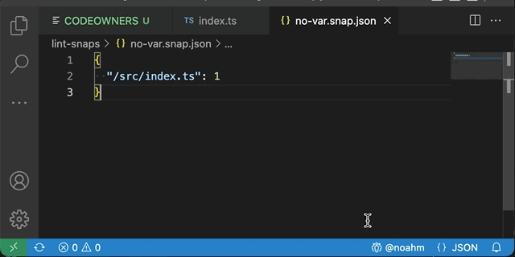
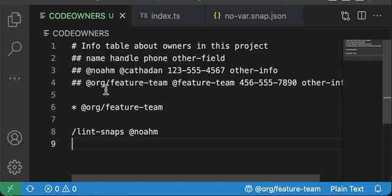

# vscode-codeowners

## Features

Displays the owner of the current file in the status bar.

Also allows you to look up info for any team via a quick-search command.

## Installation

For now this has not been published to the public extenstion registry.
Download the latest release from the releases section to the right. Run `code --install-extension vscode-codeowners-X.X.X.vsix`
Or, from the "..." menu at the top of the extensions sidebar inside VS Code, pick "Install from VISX..."

## Requirements

Add a CODEOWNERS file to your project according to [Github documentation](https://help.github.com/articles/about-codeowners/)

Team contact info will only be available for projects that include a structured contact info section
within its CODEOWNERS file according to the specs described [here](https://git-aws.internal.justin.tv/noahm/codeowners#library-usage).

## Extension Settings

No settings have been implemented yet. May one day add the ability to pick specific info field names for display in the team list.

## Known Issues

None yet!

## Release Notes

See the [changelog](CHANGELOG.md)

## Acknowledgements

Icon from the [Feather Icons](https://feathericons.com/) set used under MIT license.
